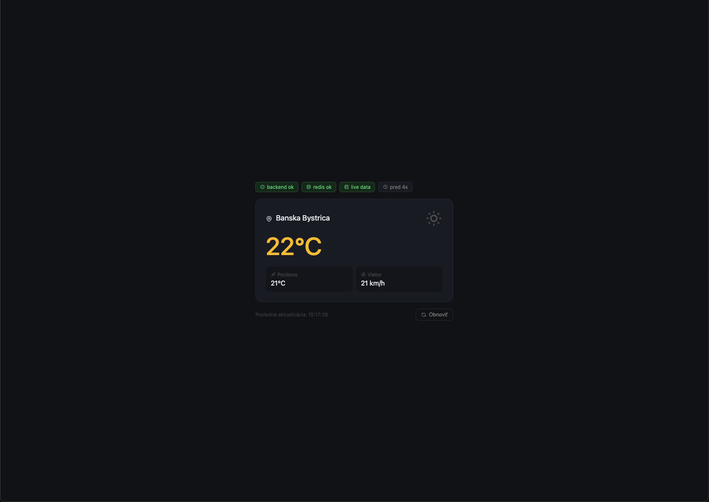
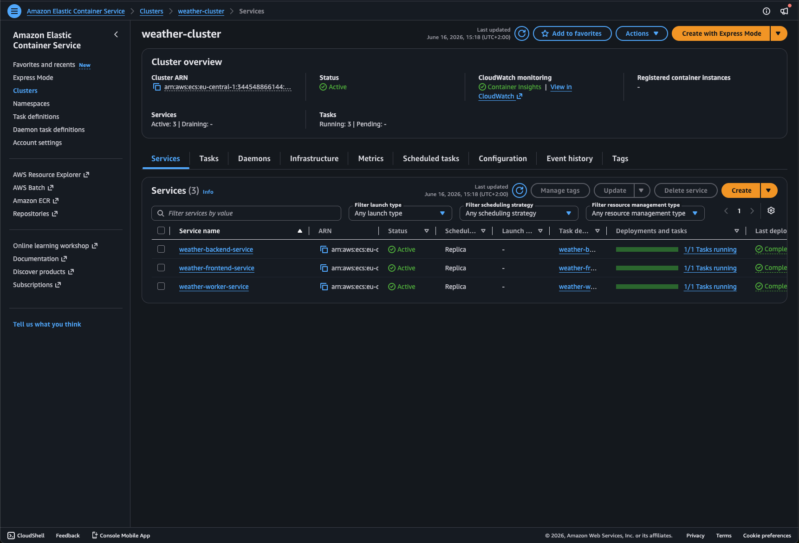
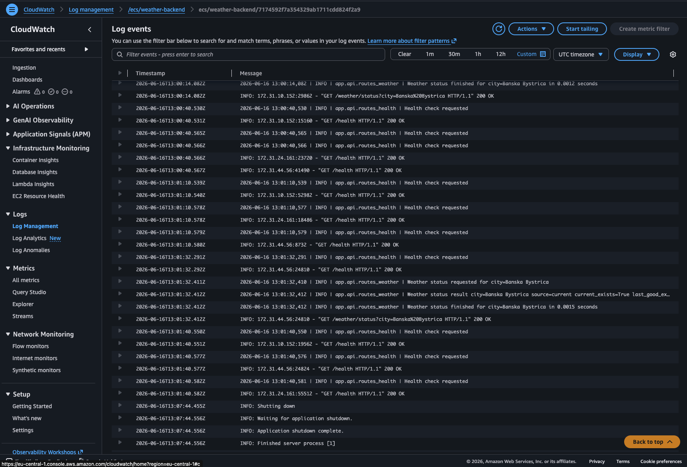
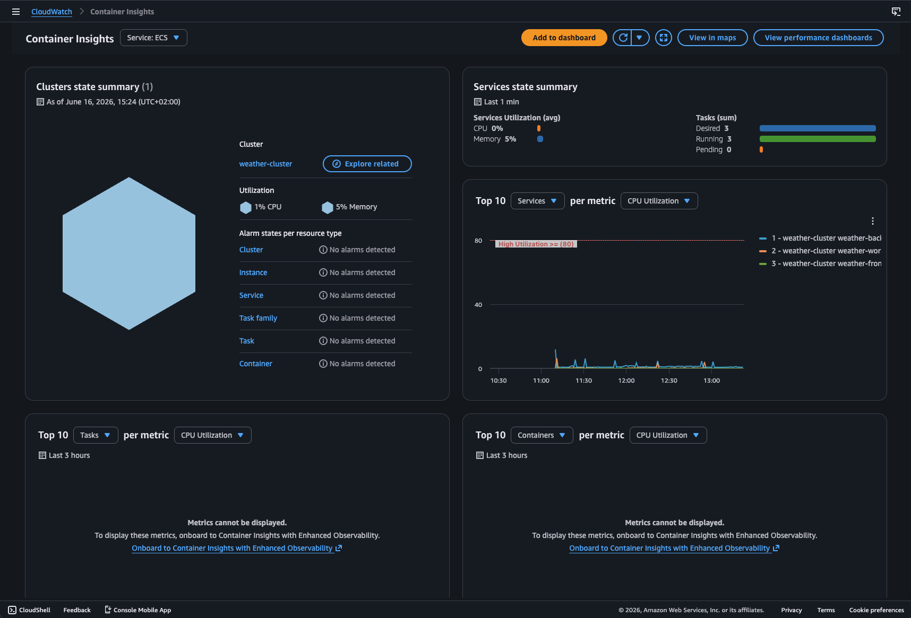
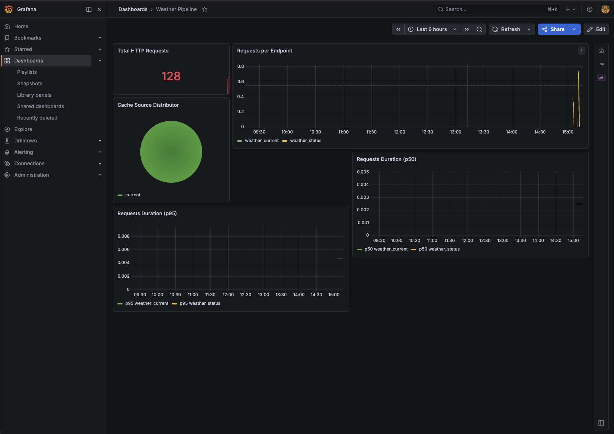
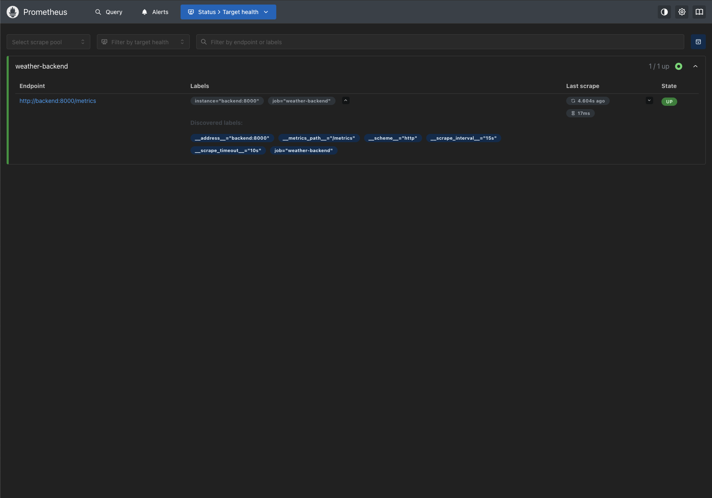
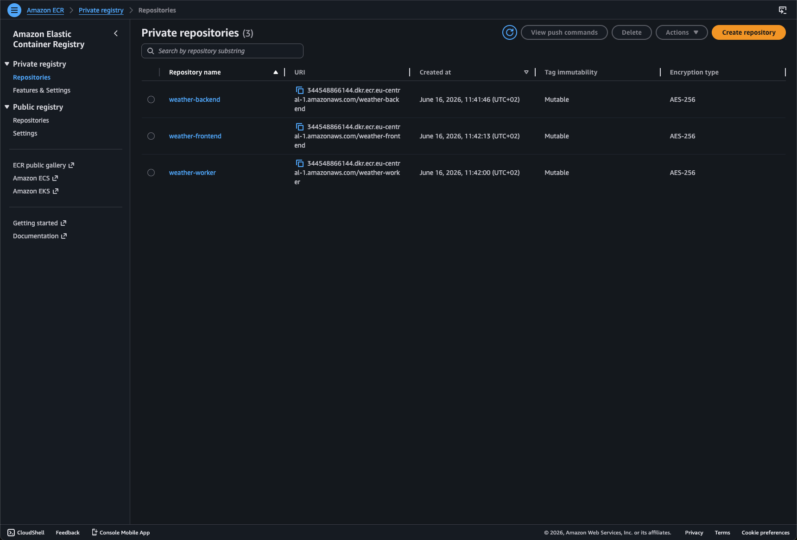
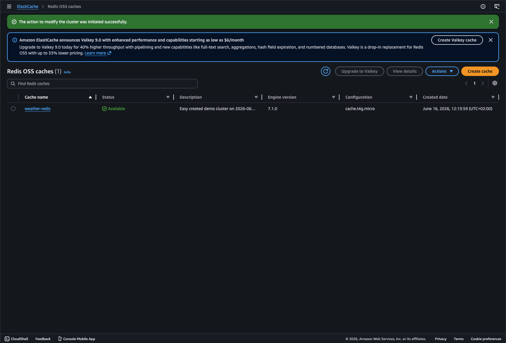
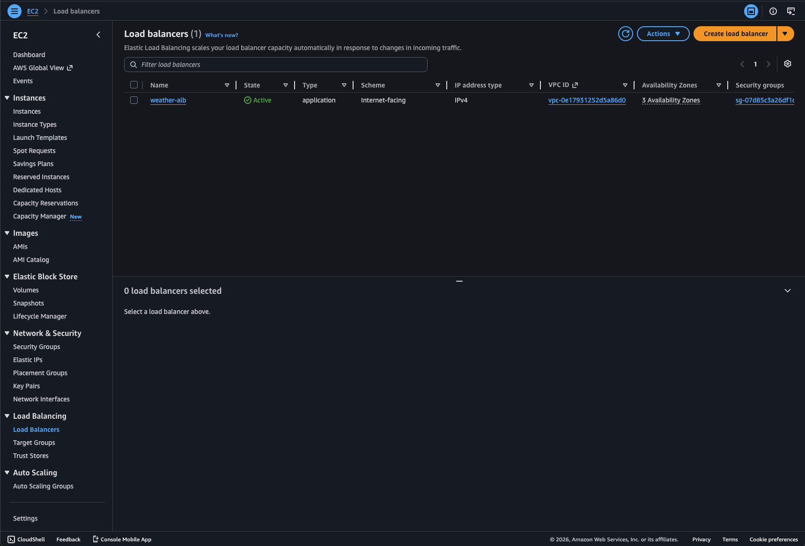
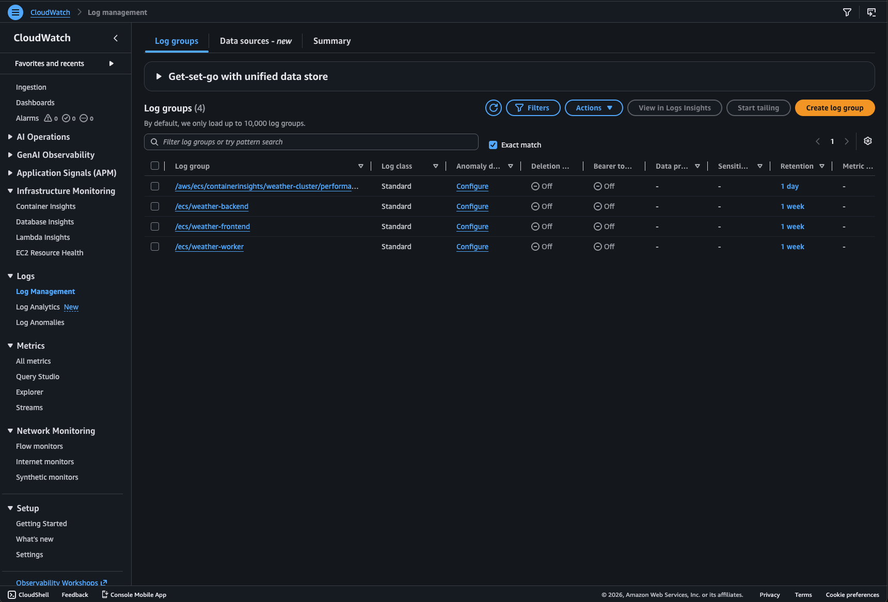

# Real-time Weather Data Pipeline

A production-ready backend system that fetches, caches, and serves real-time weather data via a REST API. Built with a focus on observability, reliability, and cloud-native deployment on AWS ECS Fargate.

## Live Demo (AWS Deployment)

> The infrastructure was provisioned on AWS ECS Fargate, validated, and subsequently torn down to avoid ongoing costs. Screenshots below are from the live deployment.

### Frontend — deployed on AWS ECS


### AWS ECS Cluster — 3 services running


### CloudWatch Logs — structured logging from backend


### Container Insights — CPU & memory monitoring


### Grafana Dashboard — request metrics and latency


### Prometheus — scraping backend metrics


---

## Architecture

```
┌─────────────┐     ┌─────────────┐     ┌─────────────┐
│   Frontend  │────▶│   Backend   │────▶│    Redis    │
│  (nginx)    │     │  (FastAPI)  │     │   (Cache)   │
└─────────────┘     └─────────────┘     └──────▲──────┘
                                               │
                                        ┌──────┴──────┐
                                        │   Worker    │
                                        │  (Python)   │
                                        └──────┬──────┘
                                               │
                                        ┌──────▼──────┐
                                        │ OpenWeather │
                                        │     API     │
                                        └─────────────┘

┌─────────────┐     ┌─────────────┐
│  Prometheus │────▶│   Grafana   │
│ (scraping)  │     │ (dashboard) │
└─────────────┘     └─────────────┘
```

- **Worker** fetches weather data from OpenWeatherMap every 60 seconds and stores it in Redis
- **Backend** serves cached data via REST API with fallback to last known good data
- **Frontend** displays live weather data with system status indicators
- **Prometheus + Grafana** provide full observability stack

## Tech Stack

| Layer | Technology |
|-------|-----------|
| Backend API | Python, FastAPI |
| Worker | Python |
| Cache | Redis |
| Frontend | HTML, CSS, JavaScript, Nginx |
| Containerization | Docker, Docker Compose |
| CI/CD | GitHub Actions |
| Cloud | AWS ECS Fargate, ECR, ElastiCache, CloudWatch, ALB |
| Monitoring | Prometheus, Grafana, CloudWatch Container Insights |

## Features

- Real-time weather data fetched from OpenWeatherMap API
- Redis caching with TTL and automatic refresh every 60 seconds
- Fallback logic — serves last known good data if fresh data is unavailable
- Health (`/health`) and readiness (`/ready`) endpoints for AWS ECS
- Prometheus metrics exposed at `/metrics`
- Structured JSON logging throughout backend and worker
- Full observability: Prometheus scraping, Grafana dashboard, CloudWatch logging
- CloudWatch Container Insights for CPU/memory monitoring per container
- Automated CI pipeline with pytest and Docker Compose smoke tests
- CD pipeline that builds, pushes to ECR and deploys to ECS on every push to main

## API Endpoints

| Method | Endpoint | Description |
|--------|----------|-------------|
| GET | `/weather/current?city=` | Current weather data from cache |
| GET | `/weather/status?city=` | Cache status and data age |
| GET | `/health` | Liveness check |
| GET | `/ready` | Readiness check (Redis ping + data check) |
| GET | `/metrics` | Prometheus metrics |

## Project Structure

```
├── backend/
│   ├── app/
│   │   ├── api/          # Routes: weather, health, metrics
│   │   ├── clients/      # Redis client
│   │   ├── core/         # Config, logging, metrics, models
│   │   └── services/     # Weather service logic
│   ├── tests/            # pytest tests
│   └── Dockerfile
├── worker/
│   ├── app/
│   │   ├── clients/      # Redis + OpenWeather API clients
│   │   ├── core/         # Config, logging, models
│   │   └── jobs/         # Weather fetch job
│   └── Dockerfile
├── frontend/
│   ├── index.html
│   ├── style.css
│   ├── app.js
│   └── Dockerfile
├── grafana/
│   ├── dashboards/       # Grafana dashboard JSON
│   └── provisioning/     # Datasource + dashboard provisioning
├── prometheus.yml         # Prometheus scrape config
├── docker-compose.yaml
├── scripts/
│   └── smoke_test.sh     # Post-deploy smoke test script
└── .github/
    └── workflows/
        ├── ci.yml         # CI: pytest + smoke tests
        └── cd.yml         # CD: build, push to ECR, deploy to ECS
```

## Running Locally

### Prerequisites
- Docker
- Docker Compose
- OpenWeatherMap API key (free at [openweathermap.org](https://openweathermap.org))

### Setup

1. Clone the repository
```bash
git clone https://github.com/gavura1/Real-time-weather-pipeline-aws
cd Real-time-weather-pipeline-aws
```

2. Create `.env` file from the example
```bash
cp .env.example .env
```

3. Add your OpenWeatherMap API key to `.env`
```
OPENWEATHER_API_KEY=your_api_key_here
```

4. Start all services
```bash
docker compose up -d
```

5. Open in browser
```
Frontend:   http://localhost
Backend:    http://localhost:8000
Prometheus: http://localhost:9090
Grafana:    http://localhost:3000  (admin / admin)
```

### Running Tests

```bash
docker compose run --rm backend pytest -v
```

## Environment Variables

| Variable | Default | Description |
|----------|---------|-------------|
| `REDIS_HOST` | `redis` | Redis hostname |
| `REDIS_PORT` | `6379` | Redis port |
| `REDIS_DB` | `0` | Redis database index |
| `REDIS_SSL` | `false` | Enable SSL for ElastiCache |
| `OPENWEATHER_API_KEY` | — | OpenWeatherMap API key (required) |
| `OPENWEATHER_BASE_URL` | — | OpenWeatherMap base URL (required) |
| `OPENWEATHER_UNITS` | `metric` | Temperature units |
| `WEATHER_TTL_SECONDS` | `300` | Redis TTL for weather data |
| `FETCH_INTERVAL_SECONDS` | `60` | Worker fetch interval |
| `STALE_AFTER_SECONDS` | `300` | Threshold for stale data |
| `MAX_AGE_SECONDS` | `10800` | Maximum accepted data age |
| `WEATHER_CITY` | `Banska Bystrica` | City to fetch weather for |
| `GF_ADMIN_USER` | `admin` | Grafana admin username |
| `GF_ADMIN_PASSWORD` | `admin` | Grafana admin password |

## AWS Deployment

The application is designed for AWS ECS Fargate deployment with the following infrastructure:

| Service | Purpose |
|---------|---------|
| **ECR** | Docker image registry for backend, worker and frontend images |
| **ECS Fargate** | Serverless container orchestration |
| **ElastiCache (Redis)** | Managed Redis cache |
| **Application Load Balancer** | Public entry point with stable DNS |
| **CloudWatch Logs** | Centralized logging via `awslogs` log driver |
| **CloudWatch Container Insights** | CPU, memory and network metrics per container |

### AWS Infrastructure Screenshots

| ECR Repositories | ElastiCache Redis | Load Balancer |
|:---:|:---:|:---:|
|  |  |  |

| CloudWatch Log Groups |
|:---:|
|  |

## CI/CD Pipeline

**CI** (`ci.yml`) runs on every push to `main`:
1. Builds backend Docker image
2. Runs pytest inside the container
3. Starts full stack with Docker Compose
4. Waits for worker to populate Redis
5. Runs smoke tests against all endpoints

**CD** (`cd.yml`) triggers automatically after CI passes:
1. Builds and pushes backend + worker images to ECR (tagged with `latest` and commit SHA)
2. Updates ECS services with `--force-new-deployment`
3. Waits for services to stabilize
4. Runs smoke test against the live AWS URL

## Monitoring

- **Prometheus** scrapes `/metrics` every 15 seconds
- **Grafana** dashboard shows request rate, p50/p95 latency, cache source distribution
- **CloudWatch** receives all container logs via `awslogs` driver
- **CloudWatch Container Insights** monitors CPU, memory and network per container

## Author

Vladimír Gavura — [github.com/gavura1](https://github.com/gavura1) · [linkedin.com/in/vladimír-gavura](https://linkedin.com/in/vladimír-gavura)